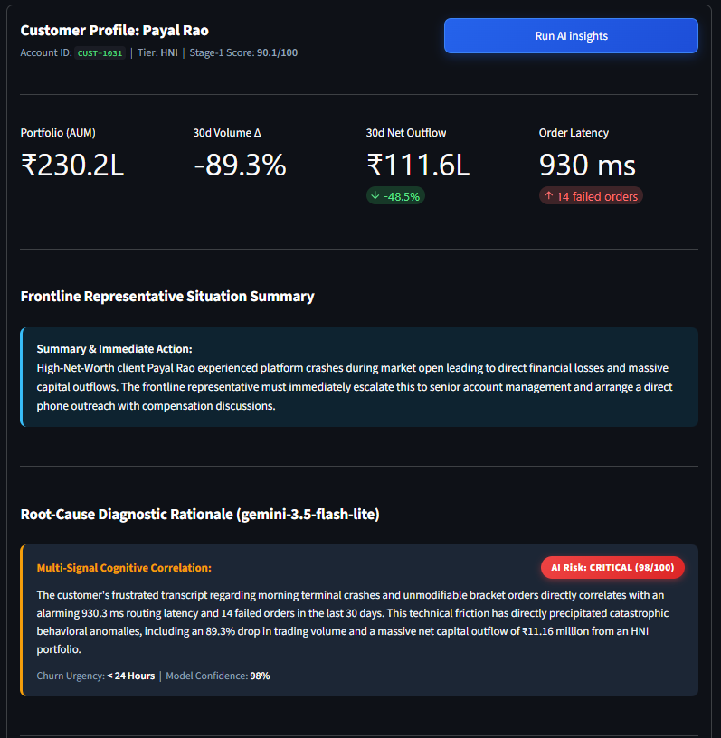
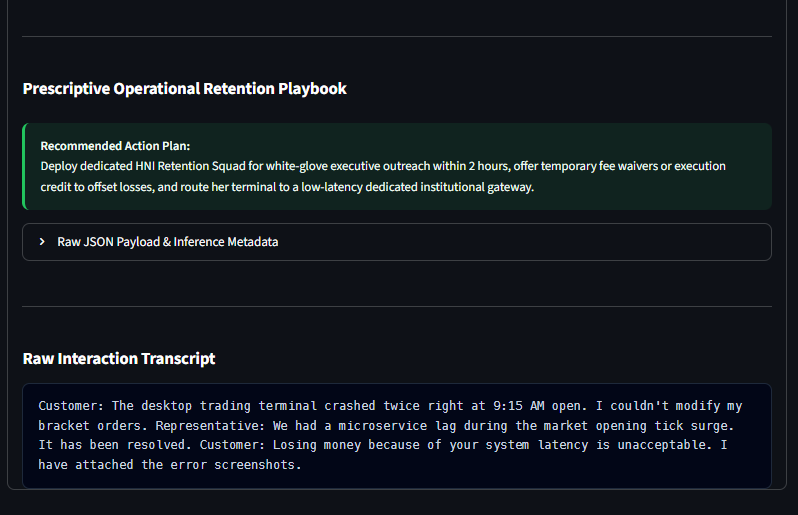

# Intelligent Customer Signal Detector (POC)
**Proactive Multi-Signal Early Warning & Retention Intelligence for Wealth-Tech Operations**

---

## Executive Overview & Problem Context
Customer operations in FinTech and Wealth-Tech platforms traditionally operate on a **reactive paradigm**:
- Operations and relationship management teams only intervene when an explicit complaint ticket or account cancellation request is logged.
- By that time, the customer has often already decided to liquidate capital or migrate their account to a competitor.
- Critical early friction signals exist across fragmented, siloed data streams:
  - *Trading Telemetry*: Order routing latency spikes, execution failures, volume drops.
  - *Financial Velocity*: Sudden liquid capital withdrawals, custodial balance depletion.
  - *Unstructured Interactions*: Subtle conversational nuance, passive-aggressive remarks, inquiries regarding transfer limits or account closure checklists.

### The Solution
The **Intelligent Customer Signal Detector** is an AI prototype that continuously monitors and correlates structured telemetry with unstructured support chat transcripts. Operating as a **Two-Stage Funnel**, it proactively surfaces at-risk customers, diagnoses the root cause of friction, and prescribes department-specific operational retention playbooks before formal escalation occurs.

---

## System Architecture: The Two-Stage Funnel

```
┌─────────────────────────────────────────────────────────────────────────────────────────────┐
│                                  RAW MULTI-SOURCE INGESTION                                  │
│  • Trading Telemetry (Volume Δ, Latency, Failed Orders)  • Financial Outflows & AUM         │
│  • Customer Support Logs & Raw Multi-turn Transcripts                                      │
└──────────────────────────────────────────────┬──────────────────────────────────────────────┘
                                               │
                                               ▼
┌─────────────────────────────────────────────────────────────────────────────────────────────┐
│                         STAGE 1: DETERMINISTIC FUNNEL & ANOMALY FILTER                      │
│  • High-throughput statistical screening across 1,000,000+ accounts                         │
│  • Evaluates 5 core operational rules (Latency > 300ms, Vol Δ < -30%, Outflow > 20% AUM,    │
│    Failed Orders ≥ 3, Support Tickets ≥ 2)                                                  │
│  • Filters out ~50-60% Healthy Cohort to eliminate unnecessary token & compute cost         │
│  • Computes baseline Telemetry Anomaly Score (0-100) & multi-signal trigger count           │
└──────────────────────────────────────────────┬──────────────────────────────────────────────┘
                                               │ Candidate At-Risk Cohort Flagged
                                               ▼
┌─────────────────────────────────────────────────────────────────────────────────────────────┐
│            STAGE 2: CONCURRENT MICRO-BATCH COGNITIVE LLM SYNTHESIS (GEMINI API)             │
│  • Chunks of 15 candidate profiles per request dispatched in parallel (max 3 workers)       │
│  • Global Cohort Baseline Injected into each prompt for relative anomaly calibration        │
│  • 100% Rate-Limit Safe: Strictly <= 5 RPM Free Tier limit with 429 auto-retry              │
│  • Multi-Signal Reasoning: Correlates unstructured transcripts with telemetry anomalies    │
│  • Generates Structured JSON: Root-Cause Rationale + Prescriptive Next Action + Urgency     │
└──────────────────────────────────────────────┬──────────────────────────────────────────────┘
                                               │
                                               ▼
┌─────────────────────────────────────────────────────────────────────────────────────────────┐
│                              OPERATIONAL ACTION & COMMAND CENTER                            │
│  • Prioritized Queue with 5-Item Pagination & Dynamic Multivariate Sorting                  │
│  • Frontline Agent Situation Summaries (5-second call briefs) & Prescriptive Playbooks      │
│  • Live "What-If" Signal Simulator for real-time testing & experimentation                  │
└─────────────────────────────────────────────────────────────────────────────────────────────┘
```

---

## End-to-End Example: Input Data vs. AI Cognitive Output

### 1. Raw Input Profile (`Payal Rao` • `CUST-1031`)

#### A. Structured Telemetry & Operational Metrics:
| Metric Field | Ingested Value | Operational Interpretation |
| :--- | :--- | :--- |
| **Customer ID / Name** | `CUST-1031` / `Payal Rao` | High Net-Worth Individual (HNI Tier) |
| **Portfolio Value (AUM)** | **₹230.2 Lakhs** (₹2.30 Crore) | High financial sensitivity |
| **30-Day Trading Volume Change** | **-89.3%** | Severe activity collapse |
| **30-Day Net Capital Outflow** | **₹111.6 Lakhs** (48.5% of AUM) | Massive capital drainage in progress |
| **Avg Order Routing Latency** | **930 ms** | 9x higher than platform baseline (100ms) |
| **Failed Orders (30d)** | **14 failed orders** | Critical order execution failures |
| **Support Tickets (30d)** | **2 tickets** | Low ticket volume despite extreme friction |
| **Stage-1 Anomaly Filter** | **Score: 90.1/100** | 5/5 risk rules triggered $\rightarrow$ Flagged for Stage-2 AI |

#### B. Raw Unstructured Interaction Transcript:
```text
Customer: The desktop trading terminal crashed twice right at 9:15 AM open. I couldn't modify my bracket orders. 
Representative: We had a microservice lag during the market opening tick surge. It has been resolved. 
Customer: Losing money because of your system latency is unacceptable. I have attached the error screenshots.
```

---

### 2. Generated Output: AI Cognitive Synthesis & Retention Playbook

#### A. Machine-Readable Structured JSON Payload:
```json
{
  "customer_id": "CUST-1031",
  "risk_level": "Critical",
  "risk_score": 98,
  "urgency_window": "< 24 Hours",
  "primary_risk_driver": "Execution Failure & High-Value Capital Outflow",
  "agent_situation_summary": "High-Net-Worth client Payal Rao experienced platform crashes during market open leading to direct financial losses and massive capital outflows. The frontline representative must immediately escalate this to senior account management and arrange a direct phone outreach with compensation discussions.",
  "signal_correlation_rationale": "The customer's frustrated transcript regarding morning terminal crashes and unmodifiable bracket orders directly correlates with an alarming 930.3 ms routing latency and 14 failed orders in the last 30 days. This technical friction has directly precipitated catastrophic behavioral anomalies, including an 89.3% drop in trading volume and a massive net capital outflow of ₹11.16 million from an HNI portfolio.",
  "prescriptive_action": "Deploy dedicated HNI Retention Squad for white-glove executive outreach within 2 hours, offer temporary fee waivers or execution credit to offset losses, and route her terminal to a low-latency dedicated institutional gateway.",
  "confidence_score": 0.98
}
```

#### B. Operational Command Center View (Frontline Representative Dashboard):
- **AI Risk Level & Score:** `CRITICAL (98/100)` • Urgency: `< 24 Hours` • Confidence: `98%`
- **Frontline Situation Brief:** *“High-Net-Worth client Payal Rao experienced platform crashes during market open leading to direct financial losses and massive capital outflows. The frontline representative must immediately escalate this to senior account management and arrange a direct phone outreach with compensation discussions.”*
- **Prescriptive Action Plan:** *“Deploy dedicated HNI Retention Squad for white-glove executive outreach within 2 hours, offer temporary fee waivers or execution credit to offset losses, and route her terminal to a low-latency dedicated institutional gateway.”*





---

## Key Differentiator: Cognitive Synthesis vs. Naive Sentiment

Traditional sentiment analysis models fail when applied to enterprise FinTech operations:
1. **The Polite Silent Churner:** A customer with a ₹3.4 Crore portfolio experiencing 840ms latency politely inquires about daily RTGS transfer limits while refusing to open more tickets. Naive sentiment scores this as *"Neutral/Polite"*, missing an imminent **₹95 Lakh capital flight**.
2. **The Passive Power User:** A loyal trader submitting 4 tickets with UX suggestions and charting feature requests is falsely flagged by naive rule-based filters (*"Tickets >= 4"*), causing ops teams to waste retention resources on an already-delighted customer.

---

## Curated Evaluation Matrix ("Golden Records")

| Customer ID | Name | Account Tier | Telemetry Anomalies | Interaction Transcript Signal | Naive Analysis Failure | Stage-2 Cognitive Synthesis |
| :--- | :--- | :--- | :--- | :--- | :--- | :--- |
| **`CUST-1001`** | Vikramaditya Singhania | **HNI** (₹3.4 Cr) | -82.5% Vol, ₹95L Outflow, 840ms Latency | Polite refusal of ticket; asking for RTGS withdrawal limits | Ignores (only 1 ticket logged) | **Critical Silent Churn (96/100)**: Latency triggered capital exit; Dispatch Principal RM within 2h. |
| **`CUST-1002`** | Rohan Deshmukh | **Pro Trader** (₹52L) | 14 Failed Orders, 5 Tickets, ₹24L Outflow | ₹65k slippage loss during expiry; threat to move algo desk to Zerodha | Flags as routine support ticket | **Critical Tech Slippage (94/100)**: Immediate Risk Desk compensation audit before algo desk migrates. |
| **`CUST-1003`** | Priyanka Sen | **Standard** (₹4.2L) | -78.0% Vol, ₹3.1L Outflow | Polite request for Tax P&L CSV and account deactivation checklist | Scored as 'Positive/Polite' | **High Competitor Churn (85/100)**: Consolidating to zero-brokerage platform; dispatch options tier upgrade. |
| **`CUST-1004`** | Karthik Ramanathan | **Standard** (₹8.5L) | 7 Failed Orders, 620ms Latency | Biometric login freezes on v4.2 update; stopped intraday trading | Treated as isolated mobile ticket | **High App Release Friction (78/100)**: Provide direct QA hotfix build and ₹1,000 goodwill voucher. |
| **`CUST-1005`** | Aditya Verma | **Pro Trader** (₹78L) | +22.0% Vol, ₹0 Outflow, 4 Tickets | Enthusiastic feedback on charting hotkeys and Greek payoff graphs | False Alarm (flagged on ticket count) | **Low Risk / Loyal Advocate (12/100)**: Route suggestions to Product UX and invite to Beta Testing cohort. |

---

## Installation & Setup Instructions

### 1. Clone & Environment Setup
```bash
git clone <repo_url>
cd Intelligent_Customer_Signal_Detector

# Create and activate virtual environment
python3 -m venv .venv
source .venv/bin/activate  # On Windows: .venv\Scripts\activate

# Install dependencies
pip install -r requirements.txt
```

### 2. Configure API Key (Optional)
Copy the example environment configuration template:
```bash
cp .env.example .env
```
Edit `.env` and add your **free Google Gemini API Key** from [Google AI Studio (aistudio.google.com)](https://aistudio.google.com/):
```env
GEMINI_API_KEY=your_gemini_api_key_here
```
> **Note:** You can also paste your API key directly into the sidebar text field inside the web application, or run the app without an API key (Stage-1 Telemetry Anomaly Screening is always active).

### 3. Generate Mock Data (Optional)
```bash
python3 src/generate_data.py
```

### 4. Launch the Streamlit Operations Command Center
```bash
./run.sh
# Or directly via streamlit:
streamlit run app.py
```
Open your browser at `http://localhost:8501`.

---

## Project Structure
```
Intelligent_Customer_Signal_Detector/
├── data/
│   └── customers.csv              # Synthetic FinTech profiles with Golden Records
├── src/
│   ├── generate_data.py           # Procedural data generator with realistic distributions
│   ├── data_loader.py             # Schema validation, Stage-1 telemetry anomaly scoring
│   └── llm_reasoning.py           # Gemini 3.5 Flash / Flash-Lite micro-batch cognitive synthesizer
├── app.py                         # Interactive Streamlit operations command center
├── run.sh                         # Quick startup script
├── requirements.txt               # Dependencies (streamlit, plotly, google-genai, etc.)
├── .env.example                   # Environment configuration template
└── README.md                      # Complete system documentation
```

---

## Technology Stack
- **Language**: Python 3.12
- **Core Processing & Scoring**: Python Data Structures / Pandas
- **AI Synthesis Engine**: Google Gemini API (`google-genai` SDK, `gemini-3.5-flash-lite` / `gemini-3.5-flash`)
- **Operations Command Center UI**: Streamlit

---

## Assumptions & Scalability Design Notes
1. **30-Day Aggregation Window**: In a live enterprise production environment, streaming telemetry (Kafka/Flink) feeds a real-time feature store (Feast/Redis) that computes sliding window metrics.
2. **Cost-Efficient Two-Stage Funnel**: Running deep LLM cognitive synthesis on 100% of accounts at million-user scale is economically unfeasible. Stage 1 filters out ~50–60% of healthy users, ensuring LLM compute is dedicated strictly to genuine anomaly candidates.
3. **Data Privacy & PII Scrubbing**: Enterprise deployments integrate an automated PII redactor (e.g., Presidio) to sanitize transcripts before LLM routing.
